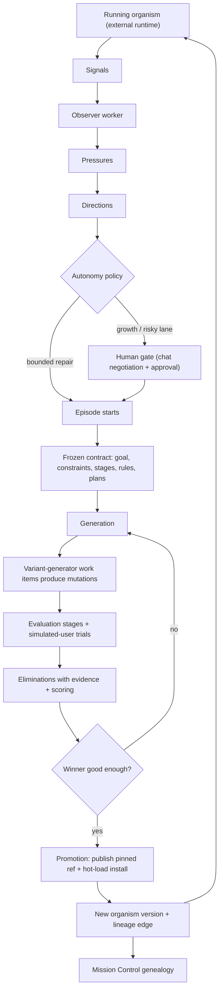

# RFC-0005: Directed Evolution

- Status: Draft
- Date: 2026-06-11 (original draft 2026-05-26 as `nerdsane/temper` RFC-0001)
- Authors: Rita, with the original draft by Codex (nerdsane/temper#280) and
  this revision by Claude (vision-completion effort)
- Related:
  - Relocated from nerdsane/temper#280; Genesis owns the Directed Evolution
    control plane per [ADR-0019](../adr/0019-canonical-genesis-paw-orchestration.md).
  - [RFC-0004](0004-github-workflow-layer.md) (GitHub workflow layer — same
    vision-completion effort)
  - [ADR-0012](../adr/0012-directed-evolution-mission-control.md) (Mission Control)
  - [ADR-0013](../adr/0013-directed-evolution-hot-load.md) (hot load by pinned refs)
  - [ADR-0014](../adr/0014-directed-evolution-generation-topology.md) (generation topology)
  - [ADR-0015](../adr/0015-directed-evolution-organism-genealogy.md) (organism genealogy)
  - [ADR-0016](../adr/0016-directed-evolution-contract-and-selection-surface.md) (contract and selection surface)
  - [ADR-0017](../adr/0017-directed-evolution-gap-closure.md) (gap closure: canonical source, three views, evidence, diffs)
  - [ADR-0018](../adr/0018-directed-evolution-gap-closure-proof-surfaces.md) (proof surfaces: diffs, trial-only simulated users, fail-closed telemetry)
  - [ADR-0019](../adr/0019-canonical-genesis-paw-orchestration.md) (canonical Genesis, shared paw-orchestration, worker vocabulary)
  - [ADR-0020](../adr/0020-idempotent-genesis-app-install.md) (idempotent install)
  - [ADR-0021](../adr/0021-genesis-ci-proof-gates.md) (CI proof gates)
  - [ADR-0022](../adr/0022-seed-journey-usage-observability.md) (seed journey usage observability)
  - [ADR-0023](../adr/0023-external-directed-evolution-runtime-targets.md) (external runtime targets)
  - [`apps/directed-evolution/APP.md`](../../apps/directed-evolution/APP.md) (the control-plane app itself)
  - [`apps/temperpaw/paw-orchestration/`](../../apps/temperpaw/paw-orchestration/) (shared execution app)

## TL;DR

Directed Evolution improves a running application the way a breeder improves
an organism: under explicit, recorded selection pressure. Real signals (errors,
telemetry, simulated-user friction, worker observations) are interpreted into
pressures and candidate directions. A human director — or, for bounded repair,
an autonomy policy — approves a direction. An episode then generates candidate
variants of the app, pushes them through declared evaluation stages and
simulated-user trials, eliminates weak variants with recorded evidence,
selects a winner, and promotes it as the new parent version in the organism's
lineage.

The control plane is a Genesis app (`apps/directed-evolution`): every concept
above is a Temper entity with a state machine, and Mission Control — the
Genesis web UI's three evolution views — explains the whole process by reading
those entities alone. Genesis never runs the agent work itself: it queues
shared `temperpaw/paw-orchestration` work items that a local worker claims,
runs (Codex today), and answers; structured results route back into domain
state through a receipt entity and a WASM router. The apps being evolved run
on external runtimes (TemperPaw production today), not inside Genesis.

A full repair episode has already run live end to end. This revision of the
RFC updates the original temper-side draft to the architecture that actually
shipped, and records what the vision-completion effort adds: automated signal
ingestion, the human direction gate, frozen episode contracts, data-driven
runtime targets, organism-generality, and end-to-end observability metadata
correlation.

---

## 1. Background

Three systems cooperate here. Skim if you know them.

**Temper** is a kernel that runs governed application state as state-machined
entities: IOA specs declare the state machines, Cedar policies gate every
transition, OData is the API surface, and WASM modules handle integrations.

**Genesis** (this repo) is a Temper-native, GitHub-compatible git server and
app registry. Apps are content-addressed (`owner/app@hash`), installable into
tenants, and forkable with recorded lineage. Per ADR-0019, Genesis is the
canonical home for Temper-native app bundles — including the Directed
Evolution app itself and the organisms it evolves.

**TemperPaw** is the operator's agent runtime: it hosts installed Temper apps
in production and runs the local worker (`paw-codex-worker`) that executes
agent jobs on the operator's machine.

Directed Evolution sits on top of all three: Genesis stores the evolution
state and app versions, TemperPaw provides execution and the production
runtime, and Temper provides the substrate everywhere.

## 2. Why this RFC exists

The original draft (temper#280) was written when two exploratory branches —
one closer to a reusable engine shape, one closer to concrete worker execution
and proof discipline — both existed but neither completed the product. The
missing center was the product contract: what Directed Evolution is supposed
to do, where agent judgment is used, what the human sees, what the entities
mean, and what counts as fully working.

Most of that contract has since been implemented, and several of the original
draft's architectural assumptions were settled differently (see §10). This
revision keeps the product contract, states the architecture as it actually
is on Genesis main, and replaces the original's speculative sections with the
recorded decisions in ADR-0012 through ADR-0023.

## 3. Product principles

1. **Agent judgment is real.** Where the system needs interpretation, product
   taste, diagnosis, or code generation, a worker-run agent does it — not a
   script wearing an agent label. Deterministic checks stay deterministic.
2. **The organism is real.** The thing being evolved is a running app on a
   real runtime, not a set of abstract specs. Agent Answers is the first
   organism; the model is organism-generic.
3. **Signals are not conclusions.** An error spike is raw evidence. An
   observer interprets raw signals into pressures and directions.
4. **Humans direct; they do not micromanage.** The human chooses growth
   directions and pins constraints. The human does not hand-pick winners when
   the agreed selection process has enough evidence to decide.
5. **Mission Control is observational.** It explains the living process from
   entity state. Negotiation between human and agent happens in chat, not in
   dashboard forms.
6. **Automation is visible.** The UI shows which lanes may proceed without
   human approval and which are gated.
7. **Every elimination explains itself.** A dead variant has a readable cause,
   linked evidence, and the rules that killed it.
8. **Evidence is first-class and fail-closed.** A stage that declares
   Datadog-measured evidence fails unless structured evidence (query, time
   window, result count, interpretation, zero-result meaning) is recorded.
   Raw links are secondary (ADR-0018).
9. **Lineage matters.** The human sees the organism changing over time, with
   real code diffs, not only the current episode.

## 4. Glossary

| Term | Meaning |
|------|---------|
| Organism | The app lineage being evolved. |
| Organism Version | A promoted version that can parent later episodes. |
| Lineage Edge | Connects a parent version to a child version, with the responsible episode and diff. |
| Signal | A raw observation: telemetry, errors, app usage, simulated-user friction, worker observation. |
| Pressure | A worker-interpreted reason the organism may need to change (repair, growth, UX, policy, data). |
| Direction | A framed candidate path for evolution, with provenance, risk, and a recommended autonomy lane. |
| Episode | One concrete evolution run pursuing a direction against a parent version. |
| Generation | One round of variants inside an episode. Episodes may run several. |
| Variant | One candidate app version produced during a generation. |
| Mutation | The concrete change a variant introduces, including its diff patch. |
| Adaptation Goal | What the episode is trying to improve. |
| Viability Constraint | Behavior the organism must preserve while adapting. |
| Selection Pressure | Episode-specific criteria for ranking survivors and choosing a winner. |
| Evaluation Stage | A declared checkpoint applied to variants: build, verification, review, behavior, viability, telemetry. |
| Stage Result | The result of one stage for one variant. |
| Metric Definition / Measurement | A reusable metric and one observed value for it. |
| Elimination Rule | A hard rule that kills a variant. |
| Scoring Rule | A soft rule that ranks survivors. |
| Evidence Artifact | Trace summary, log query result, diff, test output, or report supporting a result. |
| Trial | A simulated-user run against a variant. Trials record observations, never verdicts. |
| Selection Protocol | The frozen procedure the selector follows. |
| Simulated User Plan | The frozen persona/goal plan trials are queued from. |
| Promotion | A winning variant becoming the new parent organism version. |
| Autonomy Policy | Which pressure classes may start or promote without human approval. |
| Work Item / Worker Run | A unit of queued agent work and one execution of it (shared `paw-orchestration` entities). |
| Work Item Receipt | The Directed Evolution entity that routes a finished work item's results into domain state. |

The original draft called worker executions "brain runs." ADR-0019 settled on
worker/provider/run vocabulary, since execution is shared infrastructure, not
something unique to one agent. Remnants of the old name in fields and
historical records are migration debt, tracked in ADR-0019's follow-up.

## 5. End-to-end flow

### 5.1 Signals

Signals come from deterministic sources (errors, latency regressions, failed
actions, test failures, Datadog monitor results) and from agent observation
(a simulated user struggling with a goal, repeated friction that never
surfaces as a clean error, product opportunities inferred from usage).
Temper's app-usage telemetry (ADR-0022) gives observers a readable,
per-action event stream to query. Signals are recorded and tagged; they do
not directly become directions.

### 5.2 Pressures

An observer worker reads signals and produces pressures — reasons to consider
changing the organism:

| Class | Meaning | Default autonomy |
|-------|---------|------------------|
| Repair | Something is broken, degraded, or unsafe. | May auto-start and auto-promote when bounded. |
| Growth | The organism could become more capable. | Human approval required. |
| UX | Users (human or agent) struggle with flow or clarity. | Human approval required. |
| Policy | Governance, permissions, or safety may need to change. | Human approval required. |
| Data | Schema, retention, or data movement may need to change. | Human approval required unless classified as bounded repair. |

### 5.3 Directions

A direction is a framed candidate path. It carries its source pressures and
signals, the evidence behind them, why it matters, its class, a recommended
autonomy lane, expected effects and risks, and an initial Adaptation Goal and
Viability Constraint proposal. Mission Control shows directions as a queue
with full provenance drill-in — never as vague cards (ADR-0012).

### 5.4 Autonomy routing

The `AutonomyPolicy` entity decides whether a direction proceeds
automatically:

| Lane | Starts without human? | Promotes without human? | Examples |
|------|----------------------|-------------------------|----------|
| Bounded repair | Yes | Yes, if all viability constraints pass and blast radius is bounded. | Fix a broken action, revert a regression. |
| Supervised repair | Yes | No, unless pre-authorized. | Data-migration repair. |
| Directed growth | No | Yes, after the human-approved episode contract completes. No manual winner override. | New capability or workflow. |
| UX change | No | No, unless pre-authorized. | Layout or interaction changes. |
| Policy change | No | No. | Permissions, approval rules. |

Mission Control always shows the active lane, why it was chosen, what may
proceed automatically, and what is blocked on the human.

### 5.5 Human gate and episode contract

For growth and other non-auto lanes, the human and the agent negotiate in
chat — the goal, the constraints, what counts as winning. The negotiated
result is not prose: it is materialized as an `EpisodeStartRequest` whose
`SubmitEpisodeStartRequest` action carries the full contract (adaptation
goal, viability constraints, metrics, evaluation stages, elimination rules,
scoring rules, selection statement) and triggers the `episode_start_requestor`
WASM module, which creates the episode and its evaluation entities
(ADR-0016). Mission Control's approval control dispatches the same action —
the UI is a caller of the entity API, not a separate command surface.

Contract integrity rules:

- The `SimulatedUserPlan` and `SelectionProtocol` for an episode are frozen
  (`Draft → Active → Frozen`) before trials queue from them. Trial queueing
  requires a frozen plan; there is no silent fallback to synthetic personas.
- No variant may modify its own evaluators, stages, elimination rules,
  scoring rules, or viability constraints.

### 5.6 Generations and variants

Each generation creates variants from the current episode parent via
background variant-generator work items. Each variant records its `Mutation`
— changed files, diff refs, and the full `DiffPatch` rendered in the UI
(ADR-0018) — and the worker run that created it. Variants are installed into
isolated variant tenants for evaluation (ADR-0013).

A generation can fail honestly: the result router can create a follow-up
generation seeded with the prior generation's elimination evidence, and
Mission Control renders this topology — rounds, follow-up causality,
survivors, winner — rather than a flat variant list (ADR-0014).

### 5.7 Evaluation stages, trials, and evidence

Stages are the legible checkpoints: build, spec verification (Temper's
cascade), static review, behavioral and viability trials, telemetry, and
selection. Two boundaries from ADR-0018 are load-bearing:

- **Simulated users observe; evaluators judge.** Simulated-user work items
  target `Trial` entities and may only record journeys, observations,
  friction, and blockers. Stage pass/fail belongs to evaluator roles
  (`viability_evaluator`, `telemetry_evaluator`) targeting `StageResult`.
  A variant cannot pass because a simulated-user run said "passed."
- **Telemetry is fail-closed.** If a stage declares Datadog-measured
  evidence, the result router fails the stage unless the evaluator output
  includes structured evidence: query, time window, result count,
  interpretation, and what a zero result means.

Declared hard thresholds in elimination rules are enforced mechanically by
the router after evaluator output is parsed — an agent may explain a
judgment, but it cannot talk its way past a declared threshold.

### 5.8 Selection and promotion

A selector worker chooses the winner, constrained by the frozen selection
protocol, the recorded stage results, scoring rules, and evidence, and must
explain its conclusion in readable terms. The human does not override winners:
if the human disagrees, the contract was wrong — stop, revise, run another
episode.

Promotion publishes the winning variant as a pinned Genesis ref and hot-loads
it into the configured production tenant (ADR-0013). The `Promotion` row
records the runtime ref as install proof (ADR-0016), and a `LineageEdge`
connects parent to child with the responsible direction, episode, winning
variant, and diff.

## 6. Architecture: three planes

### 6.1 Control plane — the Genesis app

The control plane is `apps/directed-evolution`, a Temper-native app bundle
authored in Genesis (the canonical home for app bundles — GitHub and platform
repos are not app-source mirrors, per ADR-0017/0019). Its entities, grouped
as in [APP.md](../../apps/directed-evolution/APP.md):

- **Organism and lineage**: `Organism`, `OrganismVersion`, `LineageEdge`
- **Discovery**: `Signal`, `Pressure`, `Direction`
- **Episodes**: `Episode`, `EpisodeStartRequest`, `Generation`, `Variant`,
  `Mutation`
- **Evaluation**: `AdaptationGoal`, `ViabilityConstraint`,
  `SelectionPressure`, `SelectionProtocol`, `SimulatedUserPlan`,
  `EvaluationStage`, `StageResult`, `MetricDefinition`, `Measurement`,
  `EliminationRule`, `ScoringRule`, `EvidenceArtifact`, `Trial`
- **Promotion and autonomy**: `Promotion`, `AutonomyPolicy`
- **Execution bridge**: `WorkItemReceipt` (plus shared work-item provenance,
  below)

The app's WASM modules move the loop: `signal_observer` (signal → pressure →
direction routing), `episode_start_requestor` (contract materialization),
`episode_orchestrator` (generation/variant orchestration), and
`work_item_result_router` (routing finished work back into domain state,
including the fail-closed evidence gates of §5.7).

The control plane is installed into a live control tenant by pinned Genesis
refs and iterated by hot load — publish a new pinned ref, `App.Install` it —
without redeploying the Genesis server (ADR-0013, with idempotent reinstall
per ADR-0020).

### 6.2 Execution plane — shared work items, local workers

Directed Evolution never runs Codex (or any agent) itself. Execution is
pull-based through the shared `temperpaw/paw-orchestration` app
(`apps/temperpaw/paw-orchestration`), which owns `WorkerProvider`,
`WorkerAgent`, `WorkItem`, and `WorkerRun` (ADR-0019):

1. The control plane queues a `WorkItem`
   (`Queued → Claimed → Running → Succeeded/Failed`).
2. A local `paw-codex-worker` (in the temperpaw repo) claims it, starts a
   `WorkerRun`, and executes the role — observer, variant generator,
   simulated user, evaluator, selector — with Codex as today's provider.
3. The worker finishes the shared work item and records a Directed Evolution
   `WorkItemReceipt` (`RouteSucceededWorkItem` / `RouteFailedWorkItem`),
   whose trigger fires the `work_item_result_router` WASM module to route the
   structured result into domain state.

Workers run on the operator's machine as clients of the deployed server; the
deployed system owns entities and UI, local workers own agent execution.

### 6.3 Runtime plane — external targets

The organisms themselves run outside Genesis (ADR-0023). Each organism
carries an explicit runtime target — runtime base URL, runtime tenant,
Datadog service, and the names of runtime auth secrets (never the secrets
themselves). Simulated users exercise the app through that runtime; observer
queries and observability links target the runtime's Datadog service. Agent
Answers, the first organism, runs on the TemperPaw production runtime
(tenant `agent-answers-seed`, `service:temperpaw`).

This keeps Genesis as control plane and source of truth while the evolved
app's live behavior — and its telemetry — belongs to the runtime that
actually executes it.

### 6.4 What moves state

| Thing | Moves state? | Role |
|-------|--------------|------|
| Human chat | Indirectly | The human directs; the agent materializes entity actions (e.g. the episode contract). |
| Mission Control UI | Operational actions only | Approve direction, dismiss, pause/resume/stop, pin constraint — explicit entity actions, identified as a human agent so Cedar applies the same matrix as chat-mediated direction (ADR-0012). |
| Temper entities | Yes | Source of truth for every transition listed in §6.1. |
| Local worker | Yes, through entity actions | Claims work items, runs jobs, records receipts. |
| Worker agents (Codex etc.) | Indirectly | Judge, generate, review, select, explain; outputs land via receipts. |
| WASM modules | No independent authority | Compute and route within declared triggers; outputs recorded through entity actions. |
| Datadog | No | Evidence only. Summarized into entities, fail-closed where declared; never a decision-maker. |

### 6.5 Observability

Local and deployed processes emit to the same Datadog backend. Correlation is
mechanical, not prompt-text: the Temper kernel's observation-metadata support
(temper ADR-0041) accepts an `X-Temper-Observe-Metadata` header on runtime
requests and stamps `temper.observation.*` attributes onto spans and events.
Directed Evolution join fields ride that channel: tenant, episode, direction,
generation, variant, stage, trial, persona/run, work item, app ref, runtime
ref, and role (ADR-0018). Key results are always materialized into Temper
entities — the UI never depends on opaque Datadog links.

## 7. Mission Control

Mission Control is the Genesis web UI's evolution surface. ADR-0017 settled
it into three primary views (replacing the original draft's ten-view sketch):

| View | Purpose |
|------|---------|
| Directions | All suggested, active, completed, dismissed, auto-started, and human-gated directions, with pressure class, lane, and provenance. |
| Direction Detail | One direction's episodes, generation topology, variants, trials, evaluations, eliminations with evidence, selection, promotion, and diffs. |
| Organism Genealogy | Organism versions over time: parent-to-child diffs, responsible direction and episode, current parent, failed branches. |

Rules that keep it honest:

- It renders from live entity state in a dedicated control tenant (with a
  `tenant` query parameter for inspecting another control plane); production
  views are never fixture-backed (ADR-0012).
- Evidence appears as first-class summarized records; diffs appear wherever a
  human needs to understand change — variant inspect, compare, promotion,
  app catalog, genealogy (ADR-0017/0018).
- Allowed interactions are operational and low-ambiguity: approve or dismiss
  a direction, pause/resume/stop an episode, pin a viability constraint,
  inspect a death report, compare variants. Not allowed: editing evaluation
  criteria in forms, manually promoting a winner, or pretending a click
  replaces negotiation. If something needs back-and-forth judgment, it
  happens in chat; the UI updates because entities changed.
- If live data is missing (e.g. no lineage edges), the UI says so instead of
  synthesizing (ADR-0015).

## 8. Status as of 2026-06-11

### Implemented and live-proven on main

- The control-plane app with the full entity vocabulary of §6.1, installed by
  pinned Genesis refs and iterated by hot load.
- The execution bridge: shared paw-orchestration work items, a local
  paw-codex-worker, and receipt-based result routing.
- Mission Control's three views reading live entities: direction provenance,
  generation topology (including an honestly failed first generation with an
  evidence-fed follow-up), contract and selection surfaces, organism
  genealogy, and code diffs at variant inspect/compare, promotion, catalog,
  and genealogy.
- The proof-surface discipline: trial-only simulated users, fail-closed
  Datadog-evidence gating on telemetry stages, mechanical threshold
  enforcement, first-class evidence summaries.
- A real repair episode against the Agent Answers organism: signals →
  observer → direction → episode → generations → trials → eliminations →
  selection → promotion → lineage, with CI gates (ADR-0021) guarding the
  pre-production surfaces.

### What the vision-completion effort adds

The loop works but is not yet *alive* (nothing creates signals
automatically; human-gated directions dead-end at Dismiss) and not yet
*general* (episode context is hardcoded to one organism). This effort closes
that, in the same single Genesis PR as RFC-0004's workflow layer:

- **Frozen episode contracts.** Episode start populates and freezes the
  `SimulatedUserPlan`, `SelectionProtocol`, and evaluator reference; trial
  queueing enforces the frozen plan instead of silently falling back to a
  minimal synthetic persona.
- **Data-driven runtime targets.** The ADR-0023 runtime target (base URL,
  tenant, Datadog service, auth secret names) becomes entity data per
  organism, replacing the current single-app hardcode in the web context.
- **Organism-generality.** Episode prompts derive bundle and app refs from
  the `Organism` entity; the hardwired Agent Answers text goes away, proven
  with a second organism.
- **Human direction gate.** Mission Control's Directions view gains the
  approval action that dispatches `SubmitEpisodeStartRequest`, so human-gated
  directions can actually start episodes from the UI.
- **Automated signal ingestion with dedup.** Scheduled observer-scout work
  items query Datadog per organism runtime service and record signals, with
  fingerprint dedup on `Signal` so a repeating error produces one signal, not
  a direction spam.
- **Observability metadata correlation (temper ADR-0041 consumers).** Workers
  send `X-Temper-Observe-Metadata` on runtime calls and inject join context
  into child processes mechanically, so `temper.observation.*` correlation
  works end to end in production rather than existing only as unused kernel
  support.
- **Audit polish.** Lower-bound (≥) threshold semantics, the remaining
  BrainRun → WorkerRun terminology migration (ADR-0019 follow-up), genealogy
  rendering of `LineageEdge` diffs, and tenant/role join fields.

## 9. Non-goals

- A generic no-code evolution designer before more than one organism has been
  evolved end to end.
- Replacing chat with an in-app assistant, or letting the human manually
  select winners.
- Treating deterministic failures as final conclusions without
  interpretation.
- Running agent execution inside the deployed Genesis process.
- Shipping fixture-backed dashboards and calling them complete.
- The always-on Evolution Agent (continuous watcher, cross-project
  aggregation, chat-channel presence) — recorded as a separate future effort
  with its own RFC.

## 10. Resolved questions from the original draft

The 2026-05-26 draft left eight open questions. Where they landed:

1. *Where does the control plane live?* Deployed Genesis, in a dedicated
   control tenant, hot-loaded by pinned refs (ADR-0012, ADR-0013).
2. *How are variants isolated?* Installed into isolated variant tenants;
   the promoted winner materializes into the production tenant (ADR-0013).
3. *How do local workers and the deployed app correlate in Datadog?* Shared
   backend plus kernel observation metadata (temper ADR-0041) carrying the
   ADR-0018 join fields.
4. *Reuse of the old temper `EvolutionRun`/`IntentDiscovery` entities?*
   Neither was reused; the Directed Evolution entity model was built fresh in
   Genesis, and the old temper-side ADRs the draft referenced are superseded
   by ADR-0012..0023 here.
5. *Policy language for pre-authorized growth lanes,* and *rollback
   representation in lineage* — still open; both are recorded considerations,
   not v1 blockers.

## 11. Naming

Accepted terms: Adaptation Goal, Viability Constraint, Selection Pressure,
Evaluation Stage, Stage Result, Direction, Episode, Generation, Variant,
Mutation, Trial, Promotion, Lineage, Autonomy Policy, Worker Run.

Rejected: Fitness Charter, Assay, human winner override, and — per ADR-0019 —
"Brain Run" as user-facing vocabulary (execution is worker/provider/run
infrastructure shared across the platform).
